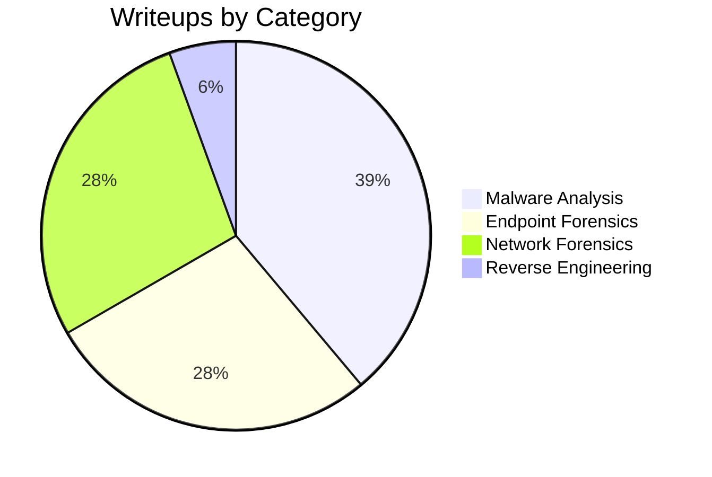

# CyberDefender Writeups

My personal writeups for [CyberDefenders](https://cyberdefenders.org/) blue team CTF challenges, covering malware analysis, endpoint forensics, reverse engineering and more.

## Structure

```
category/
└── ChallengeName/
    ├── ChallengeName.md
    └── images/
```

Each writeup documents my methodology, tools, and reasoning for solving the challenge.

## Progress


