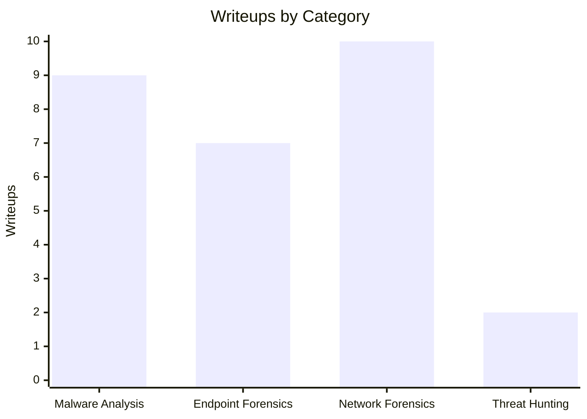

# CyberDefenders Writeups

Personal blue team CTF writeups covering memory forensics, malware analysis, network forensics, and threat hunting. All challenges sourced from [CyberDefenders](https://cyberdefenders.org/).

To view the writeups more easily, you can read them [here](https://fdv.sh/cyberdefender-writeups/).

## Writeup Coverage



**28 writeups** across 4 categories.

## Structure

Each challenge lives in its own folder under the relevant category:

```
category/
└── ChallengeName/
    ├── ChallengeName.md
    └── images/
```

Writeups cover the full methodology — tools used, approach per question, and reasoning behind each finding.
