#endpoint-forensics #volatility3 #hex-dump #byte-offset #cyberdefender-medium #reviewed #finished 
# Scenario

Investigate Windows memory images using Volatility3, PowerShell, and a hex editor to extract system artifacts, analyze processes, network connections, and reconstruct user activity.

# Questions

## What time was the RAM image acquired according to the suspect system?

Volatility 3 has a plugin that provides basic information about the memory image being analyzed.
This plugin is `windows.info.Info`.

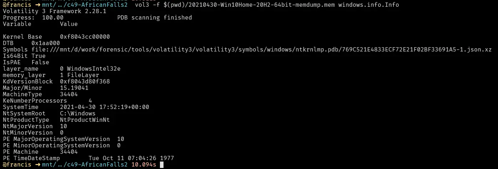

## What is the SHA256 hash value of the RAM image?

We can get this by just using `sha256sum` on Linux systems or running `Get-FileHash` on PowerShell for Windows.

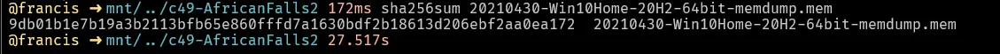

## What is the process ID of **brave.exe**?

To find the process ID we use the plugin `windows.pslist`, which lists all the processes at the time of image capture.

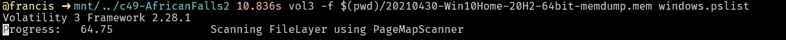
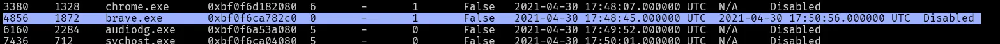

## How many established network connections were there at the time of acquisition?

To find out what network connections were established we use the plugin `windows.netscan` and `grep -i established`.
This lists all the network connections and filters for ones which were established using grep.

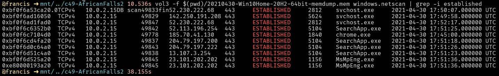

## Which domain name does Chrome have an established network connection with?

From the `windows.netscan` output, we see that Chrome has an established connection to `185.70.41.130`.
We perform a whois lookup on this and find that it is for the domain name `protonmail.ch`.

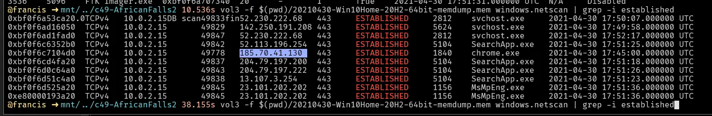

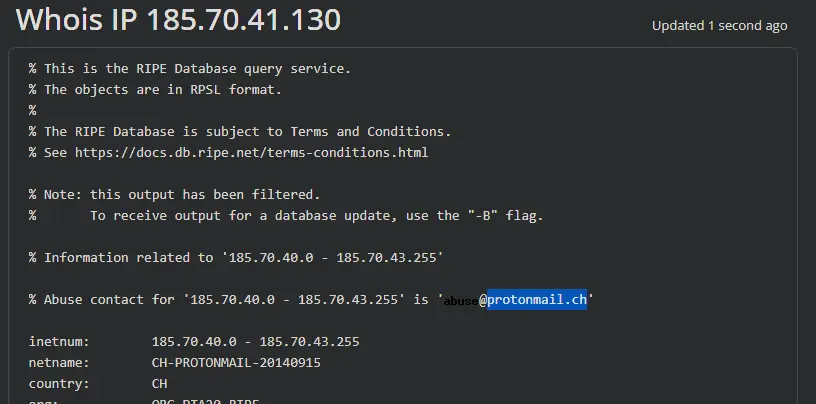

##  What is the MD5 hash value of the process executable for PID **6988**?

In Volatility3, to dump a process memory we use the plugin `windows.pslist` with arguments `--dump --pid 6988`.

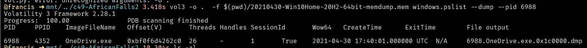

Then we just use `md5sum` for Linux systems or `Get-FileHash` in PowerShell for Windows.

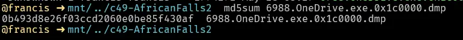

## Can you identify the word that begins at offset **0x45BE876** and is 6 bytes long?

We can do this using xxd where
`-s` → seek/start offset (byte offset)
`-l` → length of whatever we are seeking in bytes starting from offset

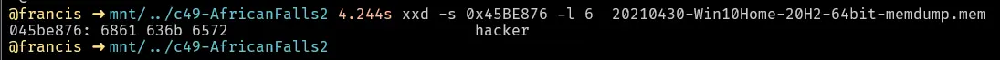

Or do it in HxD:

ctrl+g → offset → cursor jumps to byte

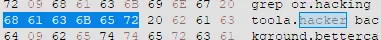

## What is the creation date and time of the parent process of **powershell.exe**?

In Volatility3, we need to use `windows.pslist` and grep for the parent PID of powershell.
The reason we use `windows.pslist` and `grep` is because the vol3 implementation of `pstree` does not include the creation date and time.

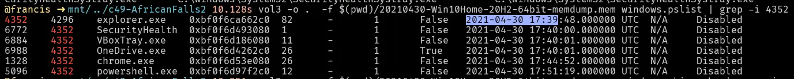

## What is the full path and name of the last file opened in notepad?

To answer this we use `windows.cmdline` and `grep` for notepad.
This tells us how notepad is being invoked and what argument it is being invoked with (i.e. what files it was opening).
Thankfully, there is only one record so we know the last file opened in notepad is this entry.

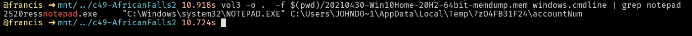

## How long did the suspect use **Brave** browser? (In Hours)

For this we use `windows.registry.userassist` which tells us the total time the user had the window in focus.

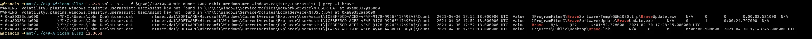

# Completion

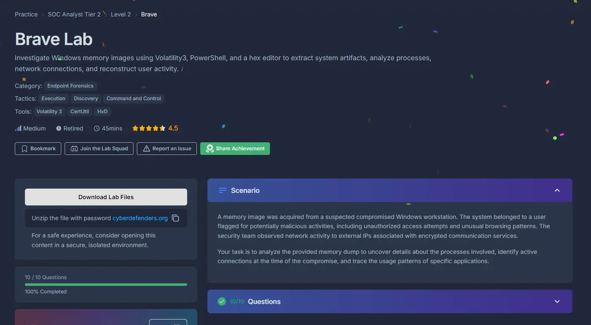
