#reverse-engineering #strings #pestudio #base64  #cyberdefender-medium #finished #reviewed 
# Scenario

RE101 challenge is a binary analysis exercise — a task security blue team analysts do to understand how a specific malware works and extract possible intel.

# Questions

## File: MALWARE000 - I've used this new encryption I heard about online for my warez; I bet you can't extract the flag

We first run the file through PEStudio and see what we can extract.

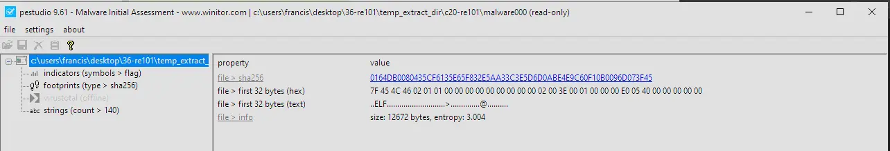

Let's look over the strings to see if anything looks encrypted.

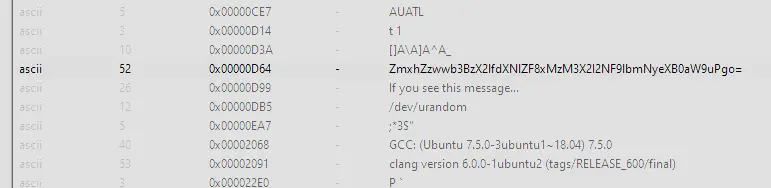

There is text that looks base64 encoded. Let's decode this and see what we get.

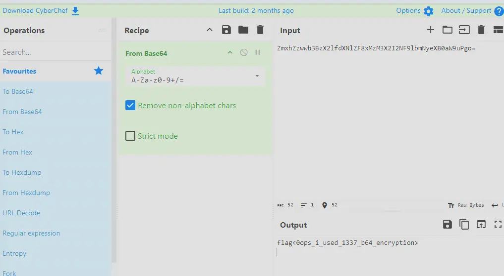

This gives us the flag `flag<0ops_i_used_1337_b64_encryption>`

## File: Just some JS - Check out what I can do!

#js-obfuscation #js-fuck

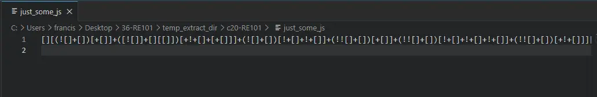

Opening the file in VSCode, we can see that the code is obfuscated using JSFuck. JSFuck uses only six characters to encode any valid JavaScript program.

We can use online tools to decode it.

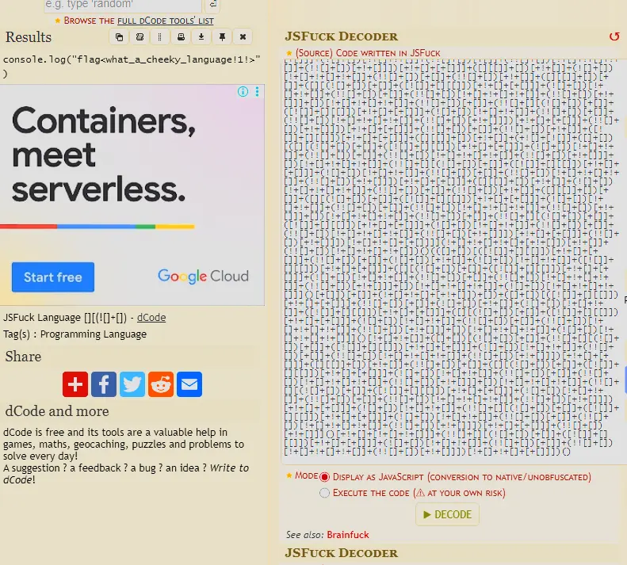

This gives us the flag `flag<what_a_cheeky_language!1!>`.

## This is not JS - I'm tired of Javascript. Luckily, I found the grand-daddy of that lame last language!

#brainfuck 

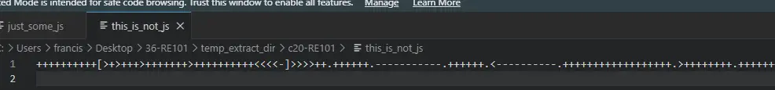

If we do a Google search, we actually find that this language is called "brainfuck".
We can use the same website to interpret the code.

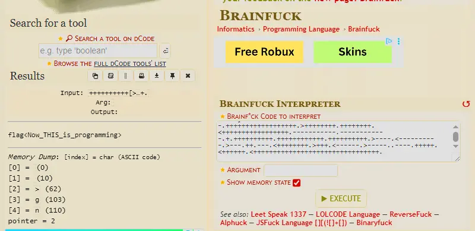

This gives us the flag `flag<Now_THIS_is_programming>`.

## File: Unzip Me - I zipped flag.txt and encrypted it with the password "password", but I think the header got messed up... You can have the flag if you fix the file

#file-header #zip 

Let's Google the zip file header format first.

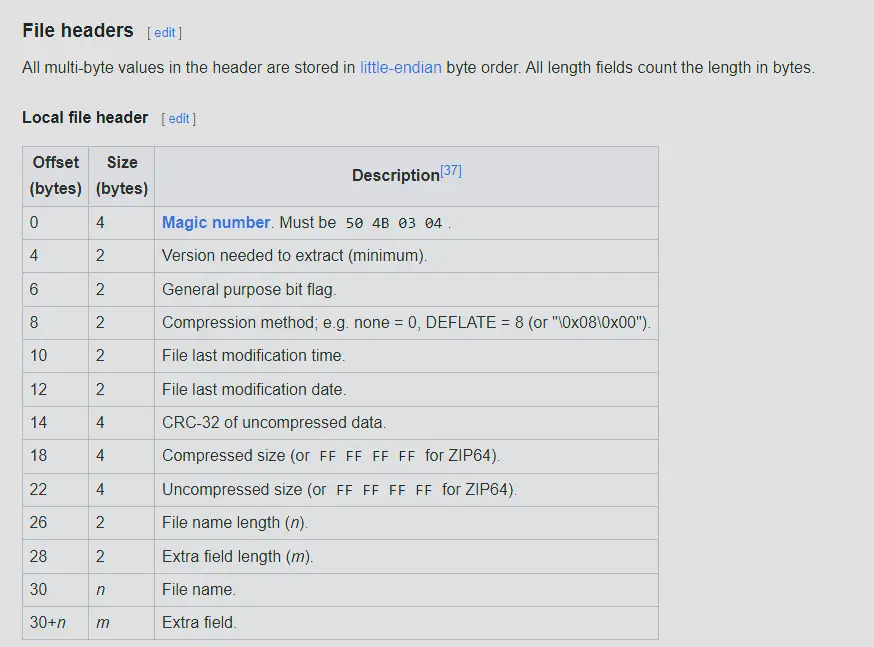

Then let's look at the file header of the broken zip.

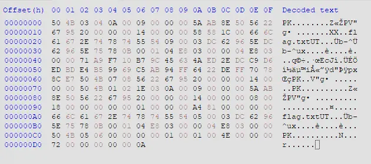

At 0x1A, that field should be the file name length.

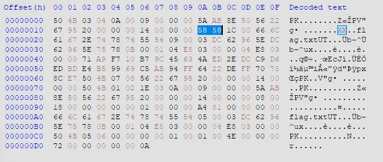

However, the current value is 0x5858 which is an absurdly large number in decimal.
The actual value should be 8 since `flag.txt` is 8 bytes long.
We can fix this in HxD and save it.

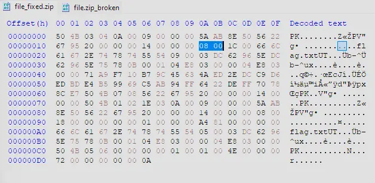

Then we can unzip the file and read the txt file inside, which shows us the flag.

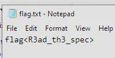

## File: MALWARE101 - Apparently, my encryption isn't so secure. I've got a new way of hiding my flags!

#ida #stack-strings

Let's first check what type of file it is.

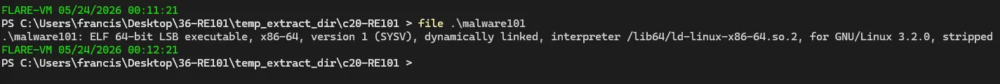

It's a Linux executable. Let's open it in IDA and see what we can find.

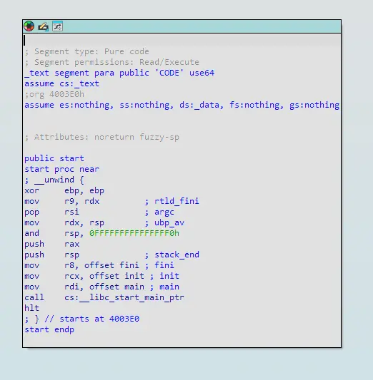

If we click into main we will see the following,

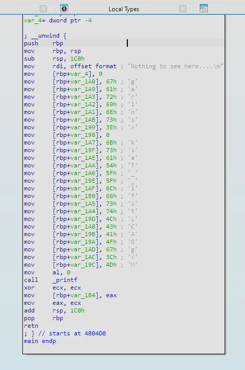

There is decoy text saying nothing to see here, but under it we see it constructing a string by pushing onto the stack.
However, notice how it is not in order. We need to view the stack to see the order in which the characters fall.
We can press Ctrl+K in IDA to view the stack.

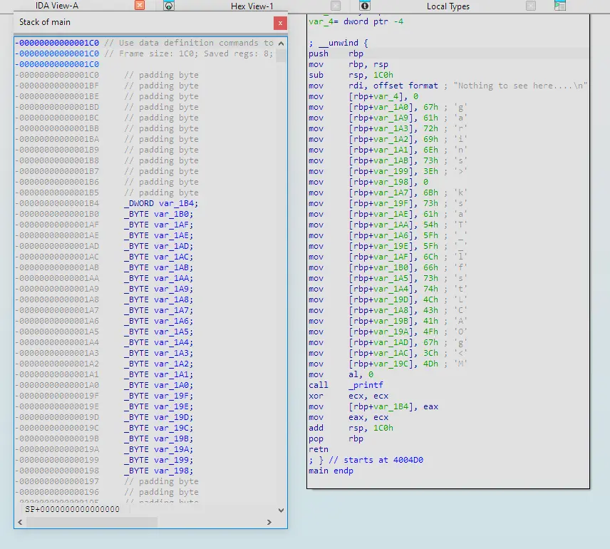

Putting them side by side, we can now manually reconstruct the string.
If we order them, we get `flag<sTaCk_strings_LMAO>0`.

## File: MALWARE201 - Ugh... I guess I'll just roll my own encryption. I'm not too good at math, but it looks good to me!

#encryption #bit-operations #xor #python

Let's first check what type of file malware201 is.

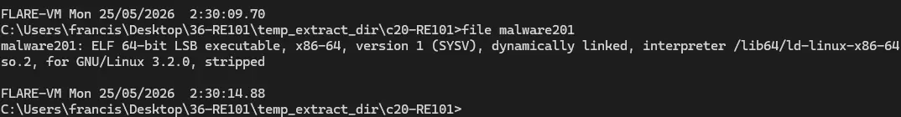

It is a Linux executable. Let's open it in IDA and click into main.

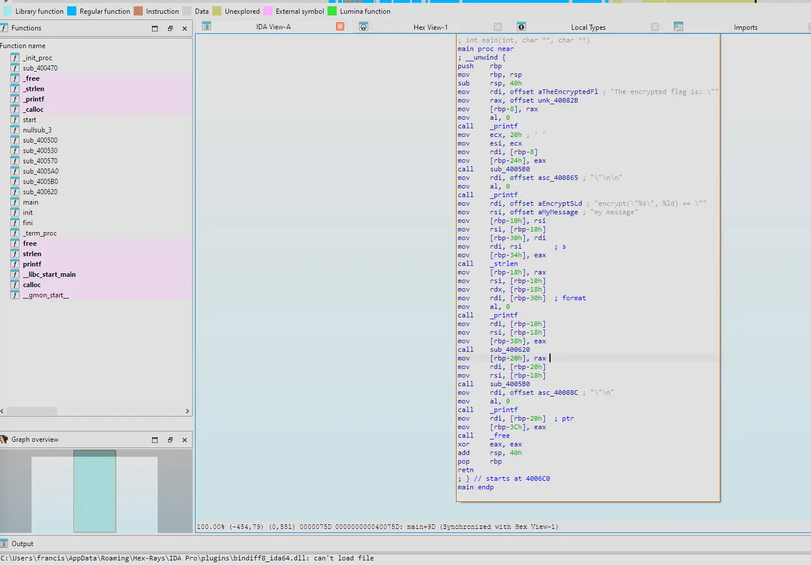

Let's see the decompiled view.

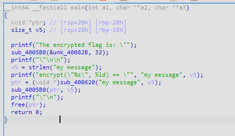

sub_4005B0 looks like a subroutine to print out ciphertext and clicking into this subroutine reveals,

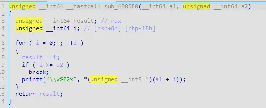

that it aims to print each byte of the cipher text represented as a 2-digit hex value (evident by the `x%02x`).
sub_400620 on the other hand looks like the subroutine for encrypting the plaintext.
This is because it takes the plaintext as an argument as well as the length of the plaintext.
In addition to that, the print statement before is stating that the program will encrypt a plaintext.
Clicking into this subroutine we can see the following,

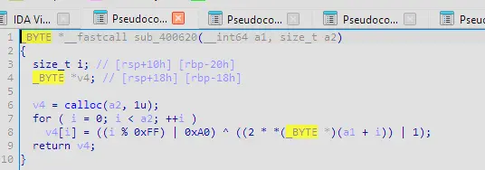

Which looks like an encryption algorithm where:
- A buffer of the same size as the plaintext length is created
- It iterates through the buffer using i to track the index
- At each position i of the buffer it is populated with an encrypted byte
- The encryption starts by determining the encryption key by clamping i to be in range 0-254 decimal then doing a bitwise OR with hex 0xA0 (decimal 160). This results in an XOR key derived from index i which is 1 byte long and the 7th and 5th bit is always 1.
- Each byte in the plaintext is first shifted left by 1 bit (multiplied by 2, overflow is truncated) and then bitwise OR'd with 1
- This makes it so the byte is always odd as when ASCII text is doubled the last bit is always 0; it then does a bitwise OR with 1 which makes the last bit always 1
- This byte is then XOR'd with the derived key
- After iterating through the entire plaintext length, it returns the pointer to the buffer which now holds the ciphertext

Let us rename these so it's more readable.

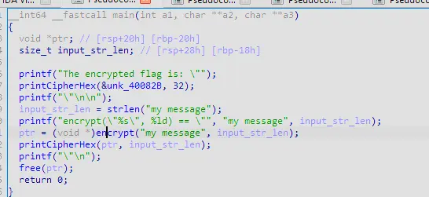

We can also extract the encrypted flag from the binary by clicking into &unk_40082B.
We also know the encrypted flag is 32 bytes long because the length of the encrypted flag (0x20) was also passed to the subroutine to print the cipher hex.

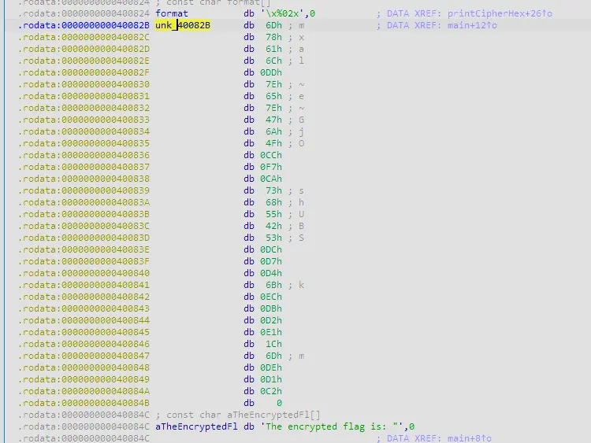

We can then export this encrypted flag as a hex string.

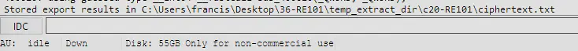

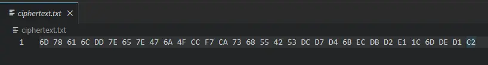

To reverse the encryption we have to do the following:
- Derive the key
- XOR the encrypted byte with the key
- Subtract 1
- Shift right by 1 bit

We can write a Python script for this.

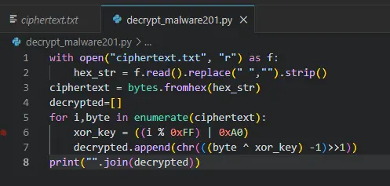

Which gives us the flag `flag<malwar3-3ncryp710n-15-Sh17>`

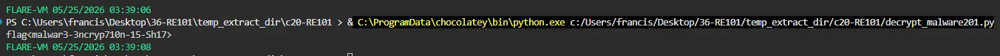

# Completion

